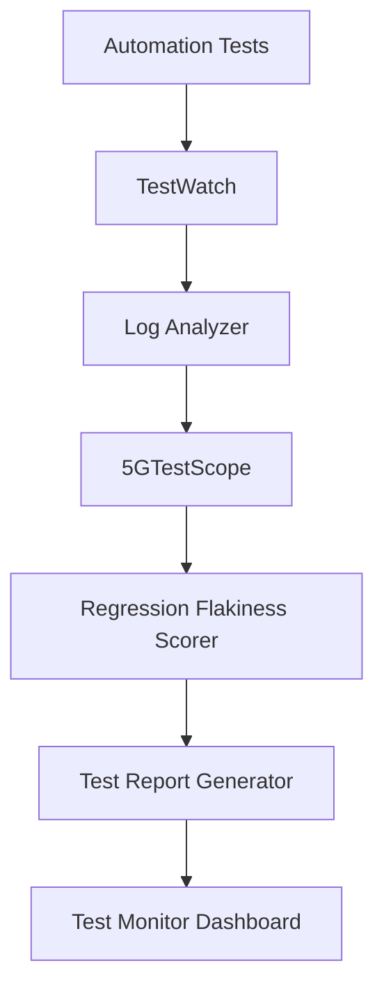

# 🚀 Telecom Test Toolkit

Open-source tools designed for **telecom and 5G test engineers**. This toolkit simplifies log analysis, regression monitoring, and test report generation for modern telecom environments.

---

## 📂 Project Structure

```text
telecom-test-tools/
├── 5g-log-analyzer/                       # General telecom log parsing
├── 5gtestscope/                           # Smart log analyzer for gNodeB/simulators
├── Regression-Flakiness-Heatmap-Scorer/   # Flaky test detection & metrics
├── test-monitor-dashboard/                # Streamlit monitoring dashboard
├── test-report-gen/                       # HTML test report generator
├── testwatch/                             # Real-time regression log monitoring
├── .gitignore                             # Project-wide ignore rules
├── LICENSE                                # MIT License
└── README.md                              # Main documentation
```

---

## 🧩 Architecture & Workflow

The toolkit provides a connected pipeline for end-to-end telecom testing validation:



---

## 📦 Tools in the Ecosystem

### 📊 [5GTestScope](file:///Users/gbvk/Downloads/repo/github/telecom-test-tools/5gtestscope)
Smart log analyzer specifically for **gNodeB and simulator logs**.
- **Key Features**: Pattern matching, error extraction, and visualization.

### 🤖 [TestWatch](file:///Users/gbvk/Downloads/repo/github/telecom-test-tools/testwatch)
Real-time **log monitoring tool** for regression runs.
- **Key Features**: Live tailing, keyword alerting, and session tracking.

### 🧪 [Regression Flakiness Analyzer](file:///Users/gbvk/Downloads/repo/github/telecom-test-tools/Regression-Flakiness-Heatmap-Scorer)
Detect flaky tests using **failure heatmaps and historical patterns**.
- **Key Features**: Stability scoring, failure distribution heatmaps.

### 📊 [Test Monitor Dashboard](file:///Users/gbvk/Downloads/repo/github/telecom-test-tools/test-monitor-dashboard)
Streamlit-based dashboard for **holistic automation test monitoring**.
- **Key Features**: Multi-run comparisons, trend analysis.

### 📑 [Test Report Generator](file:///Users/gbvk/Downloads/repo/github/telecom-test-tools/test-report-gen)
Generate **rich HTML test reports** from raw automation logs.
- **Key Features**: Interactive logs, embedded screenshots support.

### 🔍 [Telecom Log Analyzer](file:///Users/gbvk/Downloads/repo/github/telecom-test-tools/5g-log-analyzer)
General-purpose log parsing tool for various telecom test sequences.

---

## 🎯 Vision

Our goal is to build the **most comprehensive open-source toolkit for telecom test engineers**, enabling faster debugging and more stable automation pipelines.

---

## 📜 License

This project is licensed under the MIT License - see the [LICENSE](file:///Users/gbvk/Downloads/repo/github/telecom-test-tools/LICENSE) file for details.
