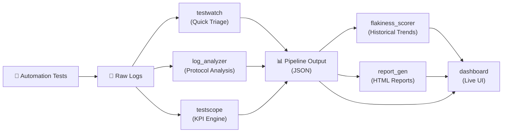

# 🚀 Telecom Test Toolkit

A unified, open-source toolkit for **telecom and 5G test engineers** — combining log analysis, regression monitoring, flakiness detection, and report generation into a single connected platform.

---

## ⚡ Quick Start

```bash
# Clone & install
git clone https://github.com/gbvk312/telecom-test-tools.git
cd telecom-test-tools
pip install -e ".[all]"

# Run the full pipeline on sample logs
ttt pipeline run --logs examples/ --output output/

# Run a single tool
ttt analyze --tool testscope --input examples/sample_gnb_log.txt

# Launch the dashboard
ttt dashboard
```

---

## 📂 Project Structure

```text
telecom-test-tools/
├── ttt/                          # Core SDK (shared models, pipeline, CLI)
│   ├── cli.py                    # Unified CLI entry point
│   ├── config.py                 # YAML config loader
│   ├── models.py                 # Shared data models (TestResult, etc.)
│   ├── pipeline.py               # Pipeline engine
│   └── registry.py               # Tool registry
│
├── tools/                        # Analysis tools
│   ├── testwatch/                # Quick pass/fail log scanner
│   ├── log_analyzer/             # 5G gNodeB protocol analysis
│   ├── testscope/                # Smart 5G KPI engine
│   ├── flakiness_scorer/         # Flaky test detection & heatmaps
│   ├── report_gen/               # HTML report generator
│   └── dashboard/                # Streamlit monitoring dashboard
│
├── examples/                     # Sample log files
├── pyproject.toml                # Package configuration
├── ttt.config.yaml               # Pipeline settings
├── requirements.txt              # Dependencies
├── LICENSE                       # MIT License
└── README.md                     # This file
```

---

## 🧩 Architecture & Data Flow

The toolkit provides a connected pipeline for end-to-end telecom testing validation:



---

## 📦 Tools in the Ecosystem

### 🔍 TestWatch — Quick Triage Scanner
Rapid pass/fail scan of log files using pattern matching.
- **Input:** Raw log files
- **Output:** `List[TestResult]` with pass/fail per line

### 📡 Log Analyzer — Protocol-Level Analysis
Deep analysis of 3GPP protocol events (ATTACH, RRC, Setup).
- **Input:** gNodeB/simulator log files
- **Output:** `AnalysisResult` with protocol KPIs

### 🔬 TestScope — Smart KPI Engine
Modular 5G log analysis with failure detection and KPI calculation.
- **Input:** 5G log files
- **Output:** `AnalysisResult` with events, failures, success rates

### 📊 Flakiness Scorer — Historical Analysis
Track test stability over time using heatmaps and transition analysis.
- **Input:** CSV test results per build
- **Output:** `List[FlakinessReport]` with diagnosis per test

### 📑 Report Generator — HTML Reports
Generate comprehensive, dark-themed HTML reports from pipeline data.
- **Input:** `PipelineOutput` (aggregated from all tools)
- **Output:** Interactive HTML report

### 🖥️ Dashboard — Live Monitoring
Streamlit-based real-time dashboard with charts and filtered views.
- **Input:** Pipeline output JSON (or mock data for demos)
- **Output:** Live web dashboard

---

## 🔧 CLI Reference

```bash
# Full pipeline (chains all tools)
ttt pipeline run --logs <dir> --output <dir>

# Single tool analysis
ttt analyze --tool testwatch --input <logfile>
ttt analyze --tool log_analyzer --input <logfile>
ttt analyze --tool testscope --input <logfile>

# JSON output
ttt analyze --tool testscope --input <logfile> --json-output

# Launch dashboard
ttt dashboard --port 8501

# Version
ttt version
```

---

## ⚙️ Configuration

Edit `ttt.config.yaml` to customize pipeline behavior:

```yaml
log_directory: "./logs"
output_directory: "./output"
enabled_tools:
  - testwatch
  - log_analyzer
  - testscope
  - report_gen
dashboard_port: 8501
```

---

## 🎯 Vision

Build the **most comprehensive open-source toolkit for telecom test engineers**, enabling faster debugging, more stable automation pipelines, and unified visibility across all test activities.

---

## 📜 License

This project is licensed under the MIT License — see the [LICENSE](LICENSE) file for details.
